## Serverless Functions
### A MongoDB database in Azure CosmosDB service is created and initialized with the sample data provided.

Data stored in Mongo DB

Advertisements

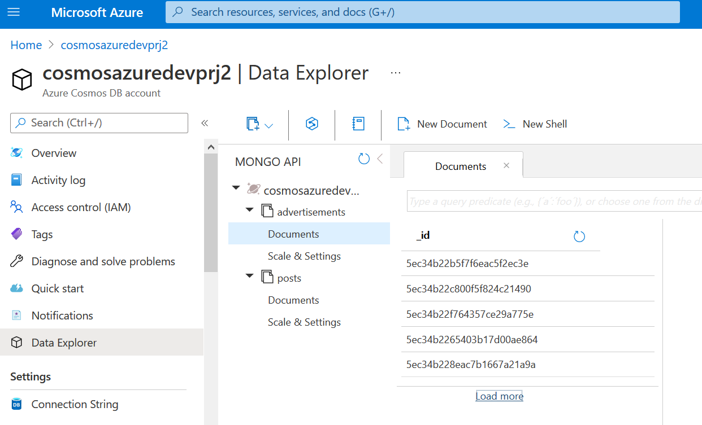

Posts

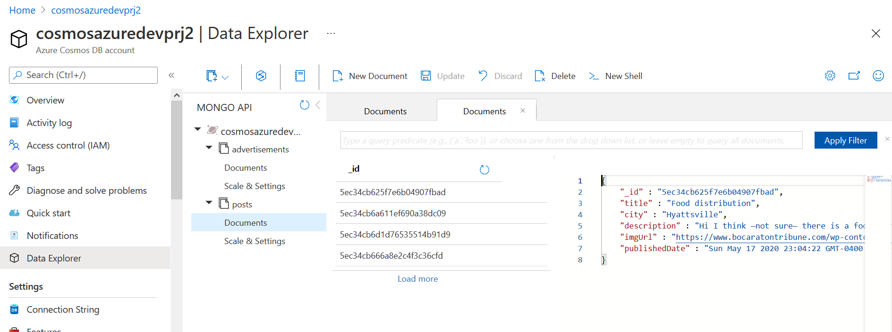

Call from the REST API (Visual Studio Code plug-in) also woks.

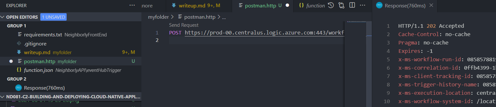

In the portal.
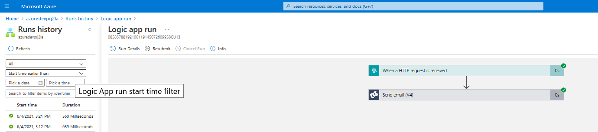

### The finished server-side application contains working Azure Functions for HTTP Triggers in Python.

  *createAdvertisement*: https://funcazuredevprj2.azurewebsites.net/api/createadvertisement
  *deleteAdvertisement*: https://funcazuredevprj2.azurewebsites.net/api/deleteadvertisement
  *getAdvertisement*: https://funcazuredevprj2.azurewebsites.net/api/getadvertisement
  *getAdvertisements*: https://funcazuredevprj2.azurewebsites.net/api/getadvertisements
  *getPost*: https://funcazuredevprj2.azurewebsites.net/api/getpost
  *getPosts*: https://funcazuredevprj2.azurewebsites.net/api/getposts
  *updateAdvertisement*: https://funcazuredevprj2.azurewebsites.net/api/updateadvertisement

Functions End Points

Followings are the live example from *getAdvertisements* 

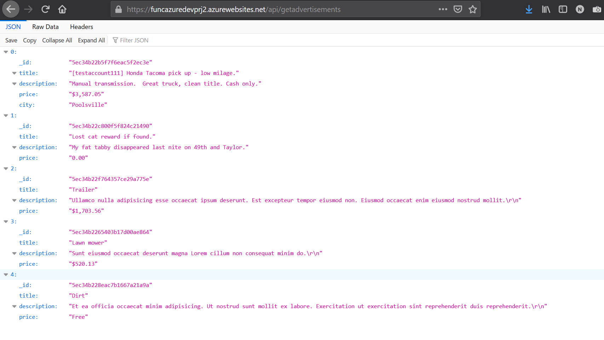

and *getPosts*

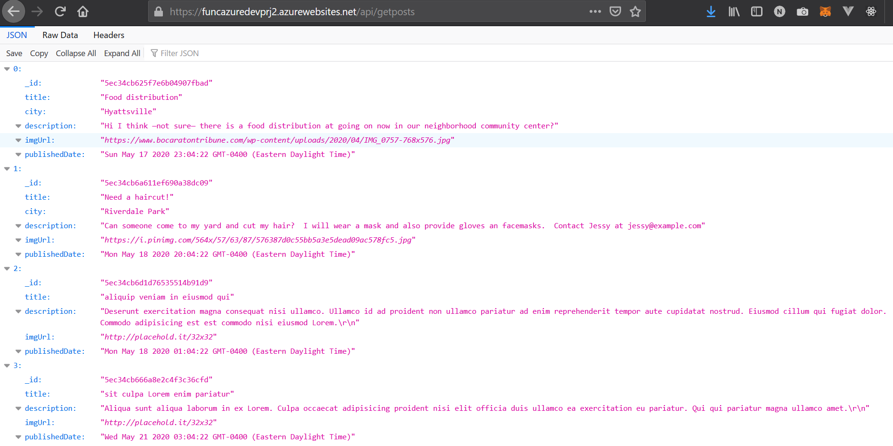

### The Azure Functions HTTP Trigger endpoints can connect to MongoDB in Azure CosmosDB service.

See above screenshots.

### The client-side application in Flask should be able to call the live Functions API endpoints that the students published in previous steps.

Accessing the URL (https://azuredevprj2webapp.azurewebsites.net) to get the following result.

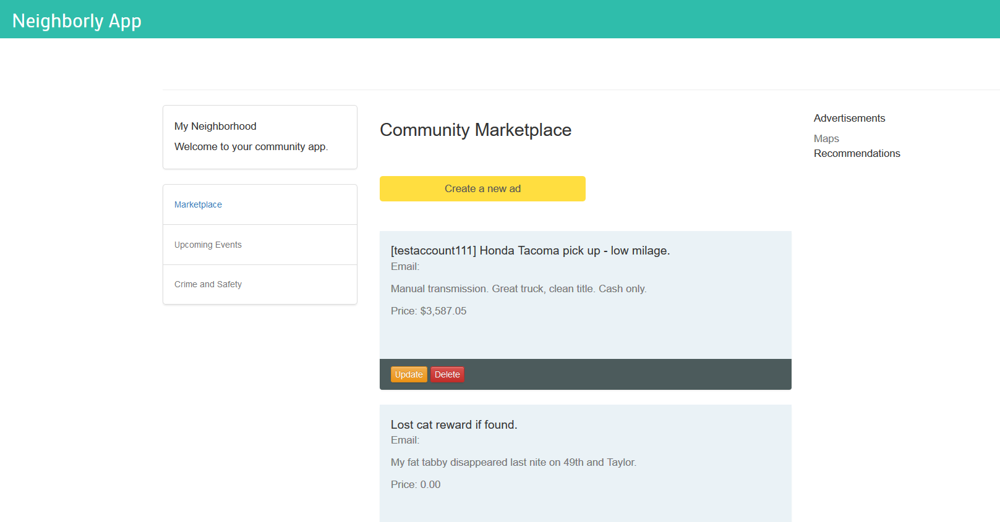

## Logic Apps & Event Hubs

### The student demonstrates mastery in using Azure Logic App Designer to create a trigger.

Definitions and test run status

The Logic App Designer
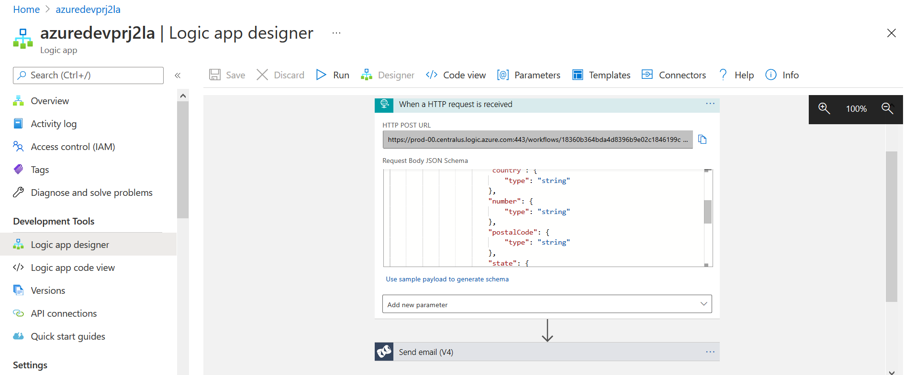

Mail was successfully sent
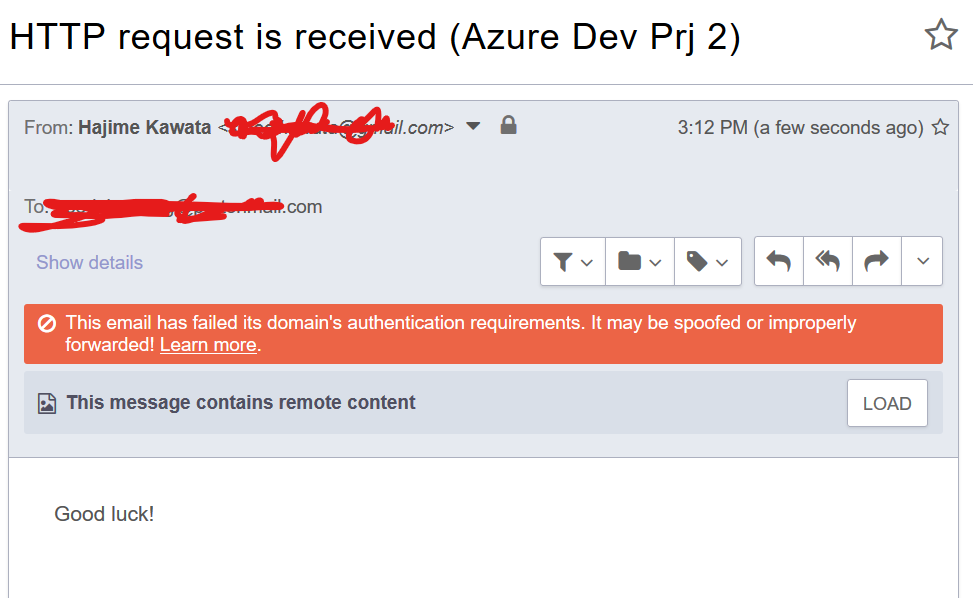

### The student should be able to create a custom event grid topic and publish the topic.

Under name space *azredevprj2ehns*, an Event Hub *azuredevprj2eh* is created.
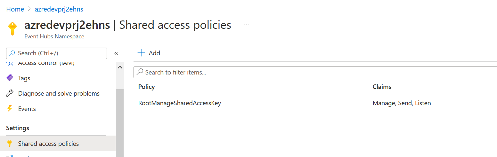

### The student should be able to add the connection string of the event hub to the Azure Function.

See above in the Shared access policies.
*azredevprj2ehpolicy* is added.

## Deploying Your Application

### The student should be able to deploy their Neighborly web application on Azure App Service.

Azure portal where Flask app deployed
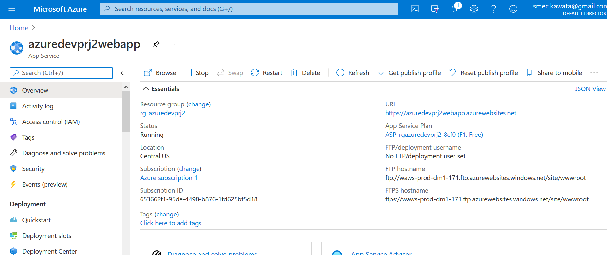

### The student should be able to containerize their Flask application with Dockerfile.

Container Registry

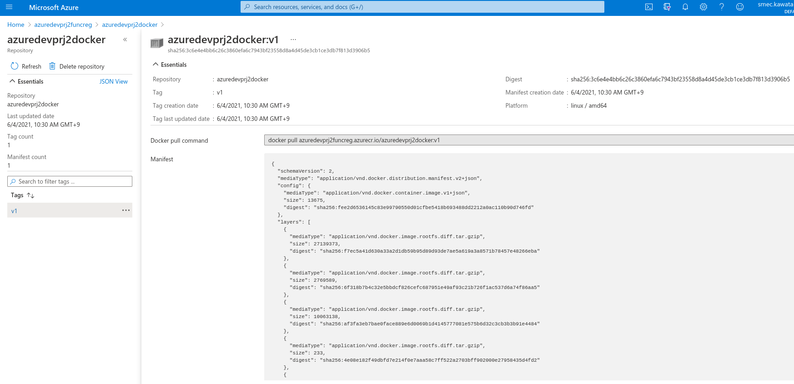

### The code demonstrates an automated pipeline to spin Kubernetes services in Azure.

